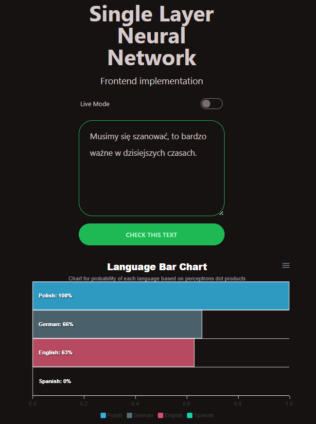
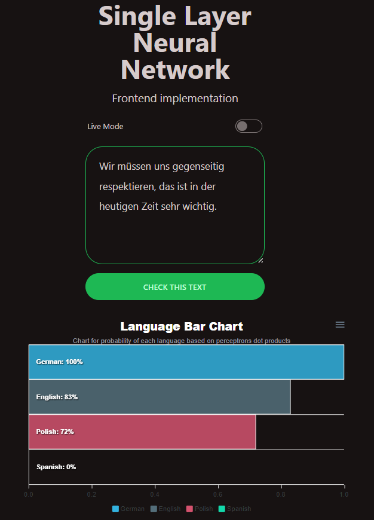
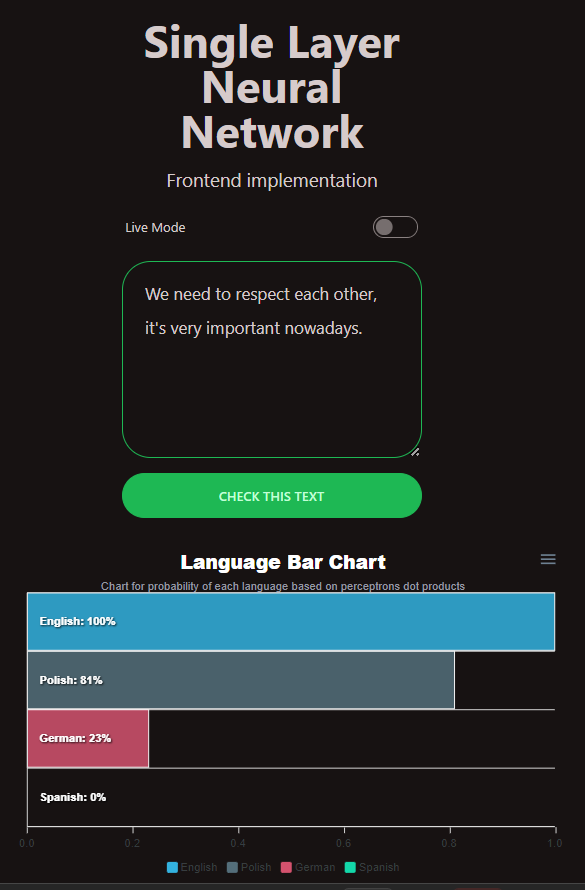



# Single Layer Neural Network (Language Recognition)

</img>

## PJAIT -  Artificial Intelligence Tools (NAI)

## PJAIT - Fundamentals of Python Programming (PPY)

### Cyprian Gburek

s24759, 17c

 

## Table of contents
* [General info](#general-info)
* [Technologies](#technologies)
* [Setup](#setup)
* [Results](#results)
* [Credits](#credits)

## General info

The aim of this project was to create a single layer neural network that would be able to recognize the language of the given text. The network was trained on 4 languages: Polish, English, Spanish and German. The network was trained on 7 files with 250 words each.

## Technologies

### [Server side](./server/):
* [Python 3.10](https://www.python.org/)
* [Unidecode](https://pypi.org/project/Unidecode/) for text normalization (removal of language specific characters).
* [Requests](https://pypi.org/project/requests/) for sending requests to the Wikipedia API.
* [Rich](https://github.com/Textualize/rich) for better text formatting.
* [Urllib](https://docs.python.org/3/library/urllib.html) for http get request parameters parsing.

### [Client side](./client-vite/):

* [Vite.js](https://vitejs.dev/) for building the project.
* [React.js](https://reactjs.org/) for creating the UI.
* [Tailwind CSS](https://tailwindcss.com/) for styling the UI.
* [Daisy UI](https://daisyui.com/) for additional Tailwind CSS components and better styling.
* [React-use](https://github.com/streamich/react-use) for React hooks.
* [Apexcharts](https://apexcharts.com/) for displaying the results.

Server initializes the neural network and exposes an API for the client to use (more info [here](./server/README.md)). Client is a simple Vite.js application that allows the user to input a text and send it to the server for language recognition. The client also displays the results of the recognition with Apexcharts graph.

## Setup

1. Clone the repository.
2. Server:
    1. Configure your own Conda environment with Python 3.10 and install the dependencies from 'requirements.txt'.
    2. Create `.env` file in the root directory and add the following environment variables (based on the [env.example](./Server/.env.example) file):
    - `PORT`: The port number to run the server on.
    - `NEURAL_NETWORK_DATA_PATH`: The path to the neural network data folder.
    - `NEURAL_NETWORK_LEARNING_RATE`: The learning rate of the neural network's perceptrons.
    - `NEURAL_NETWORK_BIAS`: The starting threshold / bias of the neural network's perceptrons.
    - `NEURAL_NETWORK_EPOCHS`: The number of epochs to train the neural network for.
    3. Run `main.py` to start the server.
    4. Wait for the neural network to train.
    5. Your server should now be running on the port you specified in the `.env` file.
 3. Client:
    1. Type 'cd client-vite' in the terminal to enter the client directory.
    2. Run `npm install` to install the dependencies.
    3. Run `npm run dev` to start the client.
    4. Your client should now be running on the port specified in the terminal.
   
## Results

The neural network was trained on 7 files with 250 words each. The training process took about ~20 seconds on average. The network was able to recognize the language of the text with significant accuracy (especially for longer texts). The results are displayed on the screenshots below.

**Polish text example:**

</img>

**German text example:**

</img>

**English text example:**

</img>

Please note that the training process is not deterministic and the results may vary. The network may also be trained on more files to improve the accuracy of the results.

## Credits

* [PJAIT](https://www.pja.edu.pl/) - The Polish-Japanese Academy of Information Technology.
* [Wikipedia](https://www.wikipedia.org/) - The free encyclopedia, from which the training data was taken.
* [Cyprian Gburek](https://sircypkowskyy.github.io/) - Author of the project.

